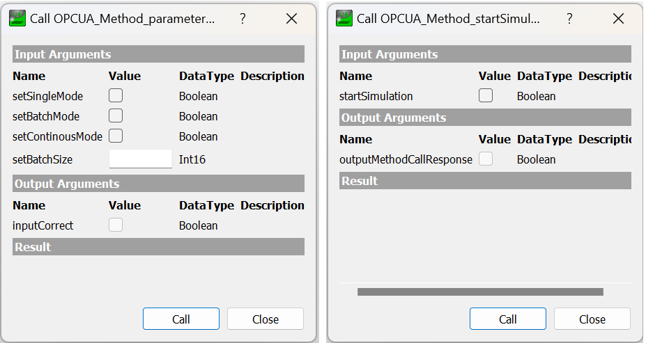

# OPC UA-based Factory Simulation for the ZfW-Course "Introduction to Production Technology"

## Usage
The factory simulation was programmed using Siemens TIA Portal V16 and exported as a library. Requirements for using the simulation library:
- S7-1200 FW version 4.4+ or S7-1500 FW version 2.5+
- OPC UA license small/medium/large

In order to include the simulation into an existing project you have to:  
1. Activate the PLCs OPC UA Server 
2. Import the Siemens library for general functions (109479728_LGF_LIB_TIAV16_V5_1_0).
3. Import the simulation library (20241112_FactorySim_LIB_TIAV16_V1_0_0).
4. Include all functions (FC), function blocks (FB) and data blocks (DB) that are stored inside the simulation library.
5. Call the FB "Fabriksimulation" from the OB1.
6. Update the OPC UA Server interface in order to expose the new variables and methods that are included in the global DBs (Anlagensimulation) of the simulation library.
7. Compile and load the project.
8. Connect via OPC UA Client, e.g. UAExpert

## Documentation of OPC UA Interface for controlling the simulation
The library defines two OPC UA methods: 
1. startSimulation
    - Input (Boolean): Start the simulation by setting input to TRUE.
    - Output (Boolean): OPC UA method response

2. parameterSimulation
    - Input:
        - setSingleMode (Boolean): single production cycle for all modules
        - setBatchMode (Boolean): production until the parametrized batch size is produced by each module
        - setContinousMode (Boolean): continous production (work-in-progress: stop-method is not implemented yet)
        - setBatchSize (Int16): batch size for corresponding mode, has to be set to 0 for other modes
    - Output (Boolean): OPC UA method response

## TODO
- [x] startSimulation method
- [ ] stopSimulation method
- [ ] pauseSimulation method
- [ ] include database injection (InfluxDB)
- [ ] switch OPC UA security mode to SignAndEncrypt using certificates

## References
[OPC UA methods for the SIMATIC S7-1500 OPC UA server](https://support.industry.siemens.com/cs/document/109756885/opc-ua-methods-for-the-simatic-s7-1500-opc-ua-server-?dti=0&lc=en-DE)
[Library of general functions (LGF)](https://support.industry.siemens.com/cs/document/109479728/library-of-general-functions-(lgf)-for-simatic-step-7-(tia-portal)-and-simatic-s7-1200-s7-1500?dti=0&lc=en-DE)
